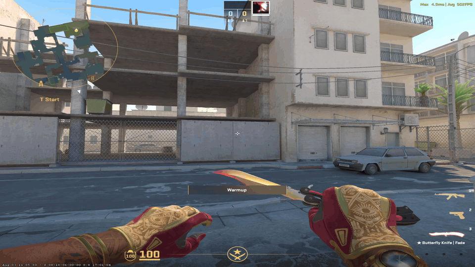
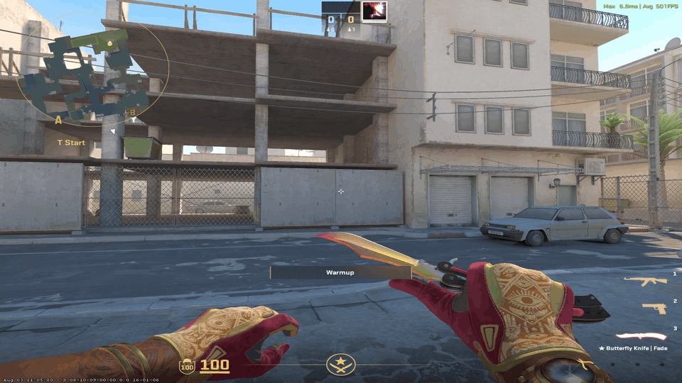

# WeaponSkins..

A CSSharp plugin for CS2 that gives players full control over how their loadout looks.

## Features
- Optional Built-in Discord Bot for linking and changing skins from Discord
- Weapon skins with float, pattern, name tag and StatTrak
- Knife selector
- Gloves selector
- Agents selector
- Music kit selector
- Pins selector
- Sticker menu with 4 slots per weapon (with optional **VIP-Only** option **OFF** by default) NOTE: !gen,!stickers share same VIP-Only optional setting
- Gen codes: apply a full custom craft with one command from [cs2inspects](https://cs2inspects.com/sticker-customizer)/[csfloat](https://csfloat.com/db)/[steam](https://steamcommunity.com/market/search?appid=730)/[cs2preview](https://cs2preview.com/craft) inspect link code
- Auto skins update after game update
- Everything is saved per player and per team in MySQL

## Showcase

<table>
<tr>
<td width="50%" align="center">
<br>
<strong>Knife,Gloves,Agents Showcase</strong>
</td>
<td width="50%" align="center">
<br>
<strong>Pin,Music Showcase</strong>
</td>
</tr>
<tr>
<td width="50%" align="center">
<br>
<strong>Skins,Stickers Showcase</strong>
</td>
<td width="50%" align="center">
<br>
<strong>Gen Showcase</strong>
</td>
</tr>
</table>

## Requirements

- CounterStrikeSharp v1.0.371 or newer
- MySQL
- Disable `FollowCS2ServerGuidelines` path: `addons/counterstrikesharp/configs/core.json`

## link system Requirements
- Use Built-in Discord bot ``"discord_bot_token": "YOUR_BOT_TOKEN"`` For link system / everything can be changed via discord
- [CS2-Discord-Utilities](https://github.com/NockyCZ/CS2-Discord-Utilities) For link system only / NO skins changes via discord

## in-game plugin Install

1. Download the latest build from Releases
2. Extract the zip into `game/csgo/`
3. Start the server once, then fill the database settings in `configs/plugins/WeaponSkins/WeaponSkins.json`
4. use `css_plugins load WeaponSkins` or Restart the server

## Discord Bot Install

1. Open the [Discord Developer Portal](https://discord.com/developers/applications) and press ``New Application``
2. Go to the ``Bot`` page and in the Privileged Gateway Intents allow ``Server Members Intent`` and ``Message Content Intent``
3. Go to the ``OAuth2`` page in ``OAuth2 URL Generator`` check ``applications.commands`` and ``bot`` then in ``Bot Permissions`` check ``Administrator``
4. Use ``Generated URL`` and paste it into your browser to invite the bot
5. Go to ``Bot`` page in ``Token`` press ``Reset Token`` copy Bot Token and put it in ``"discord_bot_token": "YOUR_BOT_TOKEN",``

## In-game Commands

| Command | Description |
| --- | --- |
| `!ws` | Skins menu |
| `!skins` | Skins menu |
| `!knife` | Knife menu |
| `!gloves` | Gloves menu |
| `!agents` | Agents menu |
| `!music` | Music kit menu |
| `!pin` | Pins menu |
| `!stickers` | Stickers menu |
| `!wear` | Set weapon wear |
| `!seed` | Set weapon seed |
| `!st` | Toggle StatTrak |
| `!g <code>` | Apply a gen code |
| `!link` | Get a Discord link code |

Command names can be changed in the config, except `!link`.

## Discord Bot Commands

| Command | What it does |
| --- | --- |
| `/link CODE` | Links your Steam account with the code `!link` gave you in game |
| `/unlink` | Removes the link |
| `/me` | Shows which Steam account you are linked to |
| `/skins` | Weapon skins, then pattern, wear, StatTrak and stickers |
| `/knife` | Knife and its skin |
| `/gloves` | Gloves and their skin |
| `/agents` | Agent model |
| `/music` | Music kit |
| `/pins` | Profile pin |
| `/stickers` | Stickers, slots 1-4 or all of them |
| `/wear` `/seed` `/nametag` `/stattrak` | Change one thing on a weapon you already skinned |
| `/gen CODE` | Apply a full craft from an inspect code |
| `/loadout` | Everything you have equipped |

## Default Config
```json
{
  "ConfigVersion": 4,
  "api": {
    "base_url": "https://cdn.jsdelivr.net/gh/ByMykel/CSGO-API@main/public/api",
    "language": "en",
    "timeout_seconds": 15
  },
  "database": {
    "host": "",
    "port": 3306,
    "user": "",
    "password": "",
    "name": "",
    "ssl_mode": "Preferred"
  },
  "discord_bot_token": "YOUR_BOT_TOKEN", // Discord bot will start/stop with cs2 server
  "linking_method": "1", // link options 1=WeaponSkinsBOT 2=Discord-Utilities
  "link_required": false,
  "discord_link": "https://discord.gg/yourserver",
  "stickers": {
    "enabled": true,
    "vip_only": false,
    "vip_flag": "@css/vip"
  },
  "agents": {
    "change_cooldown": 5
  },
  "menu": {
    "freeze_player": false,
    "items_per_page": 4,
    "show_image": true,
    "image_seconds": 2
  },
  "commands": {
    "skins": [
      "ws",
      "skins",
      "skin"
    ],
    "knife": [
      "knife",
      "knives"
    ],
    "gloves": [
      "gloves",
      "glove"
    ],
    "agents": [
      "agents",
      "agent"
    ],
    "music": [
      "music",
      "mk"
    ],
    "pins": [
      "pins",
      "pin"
    ],
    "stickers": [
      "stickers",
      "sticker"
    ],
    "nametag": [
      "nametag",
      "tag"
    ],
    "stattrak": [
      "stattrak",
      "st"
    ],
    "wear": [
      "wear",
      "float"
    ],
    "seed": [
      "seed",
      "pattern"
    ],
    "gen": [
      "g",
      "gen"
    ],
    "reload": [
      "ws_reload"
    ]
  }
}
```
## Discord Bots
- **[very important]** if you used one of the linking methods and want to change. after the change Restart or reload WeaponSkins.
### To use Built-in Discord Bot use the following config
In `WeaponSkins.json`:

```json
"discord_bot_token": "YOUR_BOT_TOKEN", // Discord bot will start/stop with cs2 server
"linking_method": "1", // link options 1=WeaponSkinsBOT 2=Discord-Utilities
"link_required": true,
"discord_link": "https://discord.gg/yourserver"
```

Restart the server once so the plugin creates the linking tables.

With `link_required` on, skin commands are blocked until the player links.

### To use Discord-Utilities use the following config
In `WeaponSkins.json`:

```json
"linking_method": "2", // link options 1=WeaponSkinsBOT 2=Discord-Utilities
```
Those options will be ignored even if they are configured
```json
"discord_bot_token": "YOUR_BOT_TOKEN"
"link_required": true,
"discord_link": "https://discord.gg/yourserver"
```
because WeaponSkins will use [CS2-Discord-Utilities](https://github.com/NockyCZ/CS2-Discord-Utilities) config

## NOTES:
- in-game inspect links from [csfloat](https://csfloat.com/db) and [steam](https://steamcommunity.com/market/search?appid=730) does work but the inspects links contain `//` if you want to ues inspect links from both you must remove one of the `//` = `/`
- full inspect links work with or without `//` with WeaponSkins built-in discord bot with !gen command
